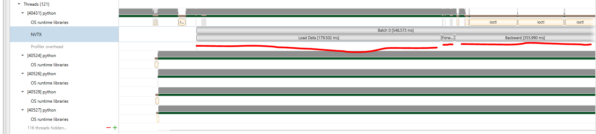

# NVTX cases:

## 1.PYTORCH

### step1: add nvtx.range_push() nvtx.range_pop()

```
import torch.cuda.nvtx as nvtx 
nvtx.range_push("Batch 0") 
nvtx.range_push("Load Data") 

for i, (input_data, target) in enumerate(train_loader): 
    input_data = input_data.cuda(non_blocking=True) 
    target = target.cuda(non_blocking=True) 
    nvtx.range_pop(); nvtx.range_push("Forward") 
    output = model(input_data) 
    nvtx.range_pop(); nvtx.range_push("Calculate Loss/Sync") 
    loss = criterion(output, target) 
    prec1, prec5 = accuracy(output, target, topk=(1, 5)) 
    optimizer.zero_grad() 
    nvtx.range_pop(); nvtx.range_push("Backward") 
    loss.backward() 
    nvtx.range_pop(); nvtx.range_push("SGD") 
    optimizer.step() 
    nvtx.range_pop(); nvtx.range_pop() 
    nvtx.range_push("Batch " + str(i+1)); nvtx.range_push("Load Data") 

nvtx.range_pop()
nvtx.range_pop() 
```

### step2: run nsys

```bash
nsys profile --output=res python nvtx_torch.py
```

### step3: visualize



## 2.TF


## 3.CUDA