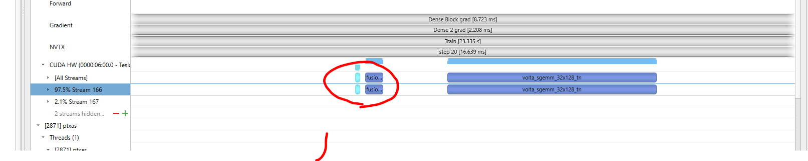
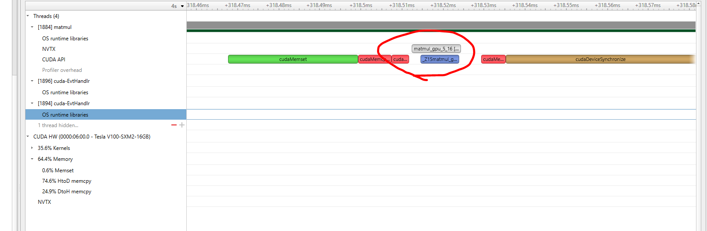

# NVTX cases:

## 1.PYTORCH

### step 1.1 insert nvtx.range_push("xxx") and nvtx.range_pop()
```
import torch.cuda.nvtx as nvtx 
nvtx.range_push("Batch 0") 
nvtx.range_push("Load Data") 

for i, (input_data, target) in enumerate(train_loader): 
    input_data = input_data.cuda(non_blocking=True) 
    target = target.cuda(non_blocking=True) 
    nvtx.range_pop(); nvtx.range_push("Forward") 
    output = model(input_data) 
    nvtx.range_pop(); nvtx.range_push("Calculate Loss/Sync") 
    loss = criterion(output, target) 
    prec1, prec5 = accuracy(output, target, topk=(1, 5)) 
    optimizer.zero_grad() 
    nvtx.range_pop(); nvtx.range_push("Backward") 
    loss.backward() 
    nvtx.range_pop(); nvtx.range_push("SGD") 
    optimizer.step() 
    nvtx.range_pop(); nvtx.range_pop() 
    nvtx.range_push("Batch " + str(i+1)); nvtx.range_push("Load Data") 

nvtx.range_pop()
nvtx.range_pop() 
```

### step 1.2 (backward layer could be recognized by seq=N)
```
with torch.autograd.profiler.emit_nvtx():
    for ...
```

### step 1.3 run nsys

```bash
nsys profile --output=res python nvtx_torch.py
```

### step 1.4 visualize


## 2.TF

### step 2.1 insert nvtx_tf.ops.start and nvtx_tf.ops.end
https://github.com/NVIDIA/nvtx-plugins
```
import nvtx.plugins.tf as nvtx_tf
x, nvtx_context = nvtx_tf.ops.start(x, message='Dense 1-3',
    domain_name='Forward', grad_domain_name='Gradient')
x = tf.layers.dense(x, 1000, activation=tf.nn.relu, name='dense_1')
x = tf.layers.dense(x, 1000, activation=tf.nn.relu, name='dense_2')
x = tf.layers.dense(x, 1000, activation=tf.nn.relu, name='dense_3')
x = nvtx_tf.ops.end(x, nvtx_context)
x = tf.layers.dense(x, 1000, activation=tf.nn.relu, name='dense_4')
```
For convenience, the package also provides a function dectorator:
```
@nvtx_tf.ops.trace(message='Dense Block', domain_name='Forward',
                   grad_domain_name='Gradient')
def dense_block(x):
    x = tf.layers.dense(x, 1000, activation=tf.nn.relu, name='dense_1')
    x = tf.layers.dense(x, 1000, activation=tf.nn.relu, name='dense_2')
    x = tf.layers.dense(x, 1000, activation=tf.nn.relu, name='dense_3')
    return x
```

### step 2.2 cases:
```bash
git clone https://github.com/YijiaZhao/NVTX-example.git
docker run -it -v $PWD/nvtx:/nvtx -w /nvtx nvcr.io/nvidia/tensorflow:22.07-tf1-py3 /bin/bash
pip install --upgrade pip
pip install nvtx-plugins
```

### step 2.2.1 keras:
```bash
bash examples/run_keras.sh
```


### step 2.2.2 tf1:
single input and output
```bash
bash examples/run_tf_session.sh
```


multi inputs and outputs
```bash
bash examples/run_tf_session_multi_ins_outs_example.sh
```


enable xla:
```bash
export TF_XLA_FLAGS=--tf_xla_auto_jit=1
bash examples/run_tf_session.sh
```


### step 2.2.2 tf2:
```bash
docker run -it -v $PWD/nvtx:/nvtx -w /nvtx nvcr.io/nvidia/tensorflow:21.10-tf2-py3 /bin/bash
pip install --upgrade pip
pip install nvtx-plugins
```
(if fail to install nvtx-plugins, upgrade the g++)

single input and output
```bash
bash examples/run_tf_session.sh
```

multi inputs and outputs
```bash
bash examples/run_tf_session_multi_ins_outs_example.sh
```

enable xla(Compared with tf1, tf2 has more fusion ops):
```bash
export TF_XLA_FLAGS=--tf_xla_auto_jit=1
bash examples/run_tf_session.sh
```

## 3.CUDA
```
#include "nvToolsExt.h"
nvtxRangePushA("matmul_gpu_3_");
matmul_gpu_3_<float><<<dimGrid, dimBlock>>>(d_a, d_b, d_c, m, n, k);
nvtxRangePop();
```
NVTX of cuda case:
```bash
mkdir build
cd build
cmake ..
make -j
nsys profile -o matmul_perf ./matmul
```

